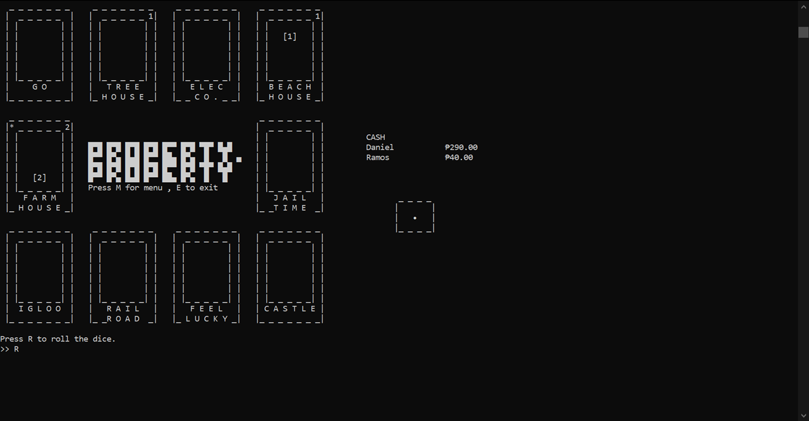

# Setup

## Screen
Make sure that the terminal is maximized.

If displays are not exhibiting expected behavior during runtime (i.e. elements displayed in the wrong places), simply resize the terminal and continue.

The program redraws the display every turn.

This is the expected output.

## ANSI Support

This program uses ANSI escape sequences which signals commands such as cursor positioning and color to the terminal.

However, some terminals don't support ANSI escape sequences.

### Command Prompt and Powershell
For these windows CLIs to support ANSI escape codes, follow these steps:

1. Go to Registry Editor.
2. Go to `HKEY_CURRENT_USER/Console`.
3. Search for the key `VirtualTerminalLevel`.
    * If not found, create a key.
5. Set the value to 1.

The key `HKEY_CURRENT_USER/Console/VirtualTerminalLevel` sets the default behavior of Windows terminals to support ANSI escape sequences.

### Windows Terminal
The new [Windows Terminal](https://www.microsoft.com/en-us/p/windows-terminal/9n0dx20hk701) supports ANSI escape code without adjustments.
